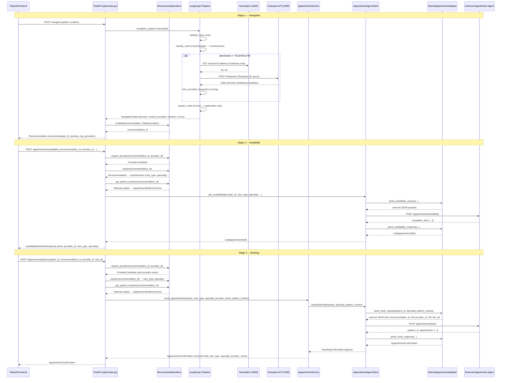
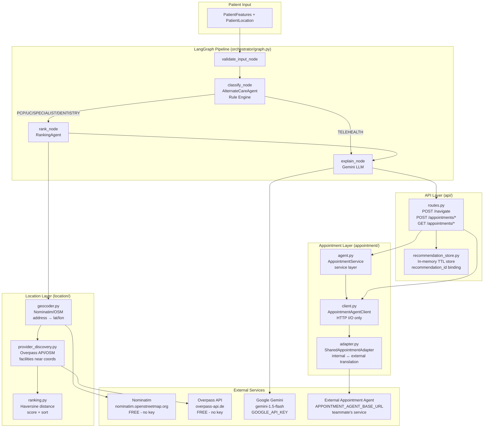

# Appointment Agent — Complete Technical Documentation

> **Scope of this document**
>
> When this project refers to "the Appointment Agent," it means two distinct things:
>
> 1. **The external Shared Appointment Agent** — a teammate-owned HTTP service at
>    `APPOINTMENT_AGENT_BASE_URL`. This project has **no source code** for that service.
>    It is accessed only via HTTP calls from this codebase.
>
> 2. **The client-side appointment layer** — all code in `appointment/` plus the routes in
>    `api/routes.py` that handle `/appointments/*`. This is what this document fully covers.
>
> Everything described here is based strictly on the actual source code. Behaviors not
> confirmed in code are labeled **NOT CONFIRMED** or **ASSUMPTION (see adapter.py)**.

---

## 1. Overview

The appointment layer is the third stage of the CarePath backend pipeline. It activates
**after** the navigation pipeline (`/navigate`) has:

1. Classified a patient's care destination (PCP, URGENT_CARE, SPECIALIST + specialty,
   TELEHEALTH, or DENTISTRY)
2. Found and ranked nearby providers via OSM/Overpass
3. Stored the result as a server-side `Recommendation` with a 30-minute TTL

Once a patient selects a provider from the recommendation, the appointment layer handles:
- Checking appointment availability
- Booking an appointment
- Rescheduling an existing appointment
- Cancelling an appointment
- Retrieving appointment status

All appointment operations are forwarded to the external Shared Appointment Agent via HTTP.
This project's code validates, translates, and enforces the trust boundary — it does not
implement availability calendars, booking engines, or provider scheduling.

---

## 2. Architecture

```
Patient/Frontend
      │
      ▼
FastAPI  (api/routes.py)
      │
      │  validates against RecommendationStore
      │  derives care_type + specialty from stored CareDecision
      │  reconstructs patient location from stored PatientLocation
      │
      ▼
AppointmentService  (appointment/agent.py)
      │
      │  service layer — enforces contracts, up-casts responses
      │
      ▼
AppointmentAgentClient  (appointment/client.py)
      │
      │  thin HTTP client — only I/O, no logic
      │
      ▼
SharedAppointmentAdapter  (appointment/adapter.py)
      │
      │  pure translation — internal models ↔ external JSON
      │
      ▼
External Shared Appointment Agent
      (teammate's service, APPOINTMENT_AGENT_BASE_URL)
      POST /appointments/availability
      POST /appointments/book
      POST /appointments/cancel
      POST /appointments/reschedule
      GET  /appointments/{id}
```

### Separation of responsibilities

| Component | File | Responsibility |
|---|---|---|
| Route handlers | `api/routes.py` | Validate recommendation binding, derive care context from store, enforce trust boundaries |
| RecommendationStore | `api/recommendation_store.py` | Bind `recommendation_id` to trusted `CareDecision` + `PatientLocation` |
| AppointmentService | `appointment/agent.py` | Service layer; up-casts responses; single module-level singleton |
| AppointmentAgentClient | `appointment/client.py` | HTTP I/O only; calls adapter for all serialisation |
| SharedAppointmentAdapter | `appointment/adapter.py` | Pure translation; all `build_*` and `parse_*` methods are static |
| appointment/schemas.py | `appointment/schemas.py` | Pydantic models for all appointment workflow data |

---

## 3. Runtime Flow

### 3.1 POST /appointments/availability

```
Caller: POST /appointments/availability
  Body: { recommendation_id, provider_id, date_range?, patient_id? }
        │
        ▼
api/routes.py  →  availability()
  1. recommendation_store.require_provider(recommendation_id, provider_id)
     → raises HTTP 404 if recommendation expired or provider not in list
  2. recommendation_store.require(recommendation_id)
     → retrieves stored Recommendation
  3. care_type = recommendation.decision.destination    ← from stored CareDecision
  4. specialty  = recommendation.decision.specialty     ← from stored CareDecision
  5. patient_location = recommendation_store.get_patient_location(recommendation_id)
     → reconstructs AppointmentPatientContext if location present; else None
  6. appointment_client.get_availability(provider_id, care_type, specialty,
                                         date_range, patient_id, patient_context)
        │
        ▼
AppointmentAgentClient.get_availability()  (appointment/client.py)
  1. SharedAppointmentAdapter.build_availability_request(...)
     → builds external JSON envelope (see §6.1)
  2. requests.post(APPOINTMENT_AGENT_BASE_URL/appointments/availability, json=payload)
     timeout=10s
  3. resp.raise_for_status()
  4. SharedAppointmentAdapter.parse_availability_response(resp.json())
     → returns List[AppointmentSlot]
        │
        ▼
api/routes.py
  → returns AvailabilityWorkflowResponse {
      available_slots: [...],
      provider_id,
      care_type,        ← from stored CareDecision
      specialty         ← from stored CareDecision
    }
```

**Key invariant:** `care_type` and `specialty` are always derived from the stored
`CareDecision`, never from the caller's request body. This is enforced in `routes.py`
before `get_availability()` is called.

---

### 3.2 POST /appointments/book

```
Caller: POST /appointments/book
  Body: { patient_id, recommendation_id, provider_id, slot_id }
        │
        ▼
api/routes.py  →  book()
  1. recommendation_store.require_provider(recommendation_id, provider_id)
     → raises HTTP 404 if recommendation expired or provider not in list
     → returns ProviderCandidate (carries authoritative provider name)
  2. recommendation_store.require(recommendation_id)
     → retrieves stored Recommendation
  3. care_type = recommendation.decision.destination
  4. specialty  = recommendation.decision.specialty
  5. patient_location = recommendation_store.get_patient_location(recommendation_id)
     → reconstructs AppointmentPatientContext; None if absent
  6. appointment_service.book_appointment(
       BookingWorkflowRequest(patient_id, recommendation_id, provider_id, slot_id),
       care_type=care_type,
       specialty=specialty,
       provider_name=provider.name,       ← from stored ProviderCandidate
       patient_context=book_patient_context
     )
        │
        ▼
AppointmentService.book_appointment()  (appointment/agent.py)
  1. Builds BookingRequest(patient_id, recommendation_id, provider_id, slot_id)
  2. self._client.book(external_request, specialty=specialty, patient_context=...)
        │
        ▼
AppointmentAgentClient.book()  (appointment/client.py)
  1. SharedAppointmentAdapter.build_book_request(patient_id, specialty, patient_context)
     → recommendation_id NEVER forwarded
     → provider_id NOT in external payload (CONTRACT GAP — see §6.2)
     → slot_id NOT in external payload (CONTRACT GAP)
  2. requests.post(APPOINTMENT_AGENT_BASE_URL/appointments/book, json=payload)
  3. resp.raise_for_status()
  4. SharedAppointmentAdapter.parse_book_response(resp.json())
     → returns AppointmentConfirmation
  5. Converts to legacy BookingConfirmation for backward compat
        │
        ▼
AppointmentService.book_appointment()
  → up-casts BookingConfirmation to AppointmentConfirmation, adds:
    - patient_id (from request)
    - status = "BOOKED"
    - provider_name (from route layer)
    - care_type (from route layer)
    - specialty (from route layer)
    - date/time (from slot.start_time)
        │
        ▼
api/routes.py
  → returns AppointmentConfirmation
```

---

### 3.3 POST /appointments/reschedule

```
Caller: POST /appointments/reschedule
  Body (Workflow A): { patient_id, appointment_id, new_slot_id }
  Body (Workflow B): { patient_id, appointment_id, preferred_date?, preferred_time? }
        │
        ▼
api/routes.py  →  reschedule()
  → appointment_service.reschedule_appointment(RescheduleRequest)
  → on exception: HTTP 502
        │
        ▼
AppointmentService.reschedule_appointment()
  → self._client.reschedule(request)
        │
        ▼
AppointmentAgentClient.reschedule()
  1. SharedAppointmentAdapter.build_reschedule_request(...)
     → recommendation_id NEVER forwarded
  2. requests.post(APPOINTMENT_AGENT_BASE_URL/appointments/reschedule, json=payload)
  3. SharedAppointmentAdapter.parse_reschedule_response(resp.json())
  → returns AppointmentConfirmation (status=RESCHEDULED)
```

**Note:** `recommendation_id` is optional for reschedule because the 30-minute
`RecommendationStore` TTL may have expired by the time a patient reschedules.

---

### 3.4 POST /appointments/cancel

```
Caller: POST /appointments/cancel
  Body: { patient_id, appointment_id }
        │
        ▼
api/routes.py  →  cancel()
  → appointment_service.cancel_appointment(CancellationRequest)
  → on exception: HTTP 502
        │
        ▼
AppointmentService.cancel_appointment()
  → self._client.cancel_appointment(request)
        │
        ▼
AppointmentAgentClient.cancel_appointment()
  1. SharedAppointmentAdapter.build_cancel_request(patient_id, appointment_id)
     → recommendation_id NEVER forwarded
  2. requests.post(APPOINTMENT_AGENT_BASE_URL/appointments/cancel, json=payload)
  3. SharedAppointmentAdapter.parse_cancel_response(resp.json())
  → returns AppointmentStatusResponse (status=CANCELLED)
```

---

### 3.5 GET /appointments/{appointment_id}

```
Caller: GET /appointments/{appointment_id}?patient_id=...
        │
        ▼
api/routes.py  →  get_appointment_status()
  → appointment_service.get_appointment_status(appointment_id, patient_id)
  → on exception: HTTP 502
        │
        ▼
AppointmentService.get_appointment_status()
  → self._client.get_appointment(appointment_id, patient_id)
        │
        ▼
AppointmentAgentClient.get_appointment()
  1. requests.get(APPOINTMENT_AGENT_BASE_URL/appointments/{id}, params={patient_id})
     ASSUMPTION: GET method + query param (contract not confirmed in spec)
  2. SharedAppointmentAdapter.parse_cancel_response(resp.json())
     → uses the flexible cancel parser (handles flat and nested responses)
  → returns AppointmentStatusResponse
```

---

## 4. The Appointment Agent as a Shared Agent

The external Shared Appointment Agent is explicitly designed to be called by multiple
agents/services across the team. This codebase is one of those callers.

### Why it is shared

From `agents/appointment_agent.py`:
> "This module is intentionally just a re-export of appointment/client.py's HTTP client.
> It exists so the agents/ package reads as the complete list of 'agents in this pipeline'
> (Classification -> Ranking -> Appointment), while making it unmistakable that the third
> one is external: your teammate's service, reused by every navigation agent on the team."

### Caller identity

The external service receives `"actor": "PATIENT"` in every request. This value is
hardcoded in `SharedAppointmentAdapter` — it is not configurable and not derived from
any caller-supplied field.

---

## 5. Input and Output Contracts

### 5.1 Availability Input Contract

```json
POST /appointments/availability
{
  "recommendation_id": "rec_aBcDeFgHiJkL",   // required — ties to stored Recommendation
  "provider_id": "osm:node:123456",             // required — must belong to recommendation
  "date_range": "next_7_days",                  // optional, default "next_7_days"
  "patient_id": "patient_001"                   // optional (backward compat: may be absent)
}
```

Fields the caller MUST NOT supply (derived from stored CareDecision):
- `care_type` — silently dropped by Pydantic; route uses stored value
- `specialty` — silently dropped by Pydantic; route uses stored value

### 5.1 Availability Output Contract

```json
{
  "available_slots": [
    {
      "slot_id": "slot_001",
      "provider_id": "osm:node:123456",
      "start_time": "2026-08-25T09:00:00",
      "end_time": "2026-08-25T09:30:00"
    }
  ],
  "provider_id": "osm:node:123456",
  "care_type": "URGENT_CARE",
  "specialty": null
}
```

### 5.2 Booking Input Contract

```json
POST /appointments/book
{
  "patient_id": "patient_001",              // required
  "recommendation_id": "rec_aBcDeFgHiJkL", // required — binds to stored Recommendation
  "provider_id": "osm:node:123456",          // required — validated against recommendation
  "slot_id": "slot_001"                      // required
}
```

### 5.2 Booking Output Contract

```json
{
  "appointment_id": "APT-001",
  "patient_id": "patient_001",
  "status": "BOOKED",
  "provider_id": "DOC-123",
  "provider_name": "Dr. Smith",            // from stored ProviderCandidate
  "care_type": "URGENT_CARE",              // from stored CareDecision
  "specialty": null,                        // null unless SPECIALIST
  "hospital_id": null,                      // from external service response
  "hospital_name": null,
  "slot": {
    "slot_id": "EXTERNAL_SLOT",            // placeholder when not in external response
    "provider_id": "DOC-123",
    "start_time": "2026-08-25T09:00:00",
    "end_time": "2026-08-25T09:30:00"      // ASSUMPTION: 30-minute default duration
  },
  "date": "2026-08-25",
  "time": "09:00"
}
```

### 5.3 Reschedule Input Contract

Workflow A (specific slot):
```json
POST /appointments/reschedule
{
  "patient_id": "patient_001",
  "appointment_id": "APT-001",
  "new_slot_id": "slot_002",
  "recommendation_id": "rec_..."   // optional — may be omitted post-TTL
}
```

Workflow B (preference-based):
```json
POST /appointments/reschedule
{
  "patient_id": "patient_001",
  "appointment_id": "APT-001",
  "preferred_date": "2026-08-30",  // at least one of preferred_date or preferred_time
  "preferred_time": "morning"
}
```

At least one of `new_slot_id`, `preferred_date`, or `preferred_time` is required
(enforced by `RescheduleRequest` model validator).

### 5.4 Cancel Input Contract

```json
POST /appointments/cancel
{
  "patient_id": "patient_001",
  "appointment_id": "APT-001"
}
```

Both fields are required. Neither `recommendation_id` nor any care context is needed.

### 5.5 Status Input Contract

```
GET /appointments/{appointment_id}?patient_id=patient_001
```

`patient_id` is optional.

---

## 6. External Wire Contract (to the Shared Appointment Agent)

### 6.1 External availability request

Built by `SharedAppointmentAdapter.build_availability_request()`:

```json
{
  "actor": "PATIENT",
  "patient_id": "patient_001",
  "request": {
    "intent": "CHECK_AVAILABILITY",
    "specialty": "ORTHOPEDICS",       // only when non-null
    "preferred_date": "2026-08-25",   // only when supplied
    "preferred_time": "morning",      // only when supplied
    "date_range": "next_7_days"
  },
  "patient_context": {                // only when patient_context arg is non-null
    "location": {
      "latitude": 37.7749,
      "longitude": -122.4194
    },
    "preference": {
      "language": "en"               // only when preferences.language is non-null
    }
  }
}
```

Fields confirmed in external spec: `actor`, `patient_id`, `request.intent`,
`request.specialty`, `request.preferred_date`, `request.preferred_time`,
`patient_context.location.*`, `patient_context.preference.language`.

### 6.2 External booking request

Built by `SharedAppointmentAdapter.build_book_request()`:

```json
{
  "actor": "PATIENT",
  "patient_id": "patient_001",
  "request": {
    "intent": "BOOK_APPOINTMENT",
    "specialty": "ORTHOPEDICS"        // only when non-null
  },
  "patient_context": { ... }          // same structure as availability
}
```

**CONTRACT GAPS (from `adapter.py` source comments):**
- `provider_id` — placement in external request not shown in spec; adapter **omits** it
- `slot_id` — not shown in spec BOOK request; adapter **omits** it
- `care_type` / `destination` — no such field in external spec; adapter **omits** it
- `recommendation_id` — **internal field, NEVER forwarded**

### 6.3 External reschedule request

Built by `SharedAppointmentAdapter.build_reschedule_request()`:

```json
{
  "actor": "PATIENT",
  "patient_id": "patient_001",
  "request": {
    "intent": "RESCHEDULE_APPOINTMENT",
    "appointment_id": "APT-001",
    "new_slot_id": "slot_002"          // Workflow A — ASSUMPTION: field name
    // OR:
    // "preferred_date": "2026-08-30", // Workflow B
    // "preferred_time": "afternoon"
  }
}
```

### 6.4 External cancel request

Built by `SharedAppointmentAdapter.build_cancel_request()`:

```json
{
  "actor": "PATIENT",
  "patient_id": "patient_001",
  "request": {
    "intent": "CANCEL_APPOINTMENT",
    "appointment_id": "APT-001"
  }
}
```

### 6.5 External booking/reschedule/cancel response (expected)

```json
{
  "patient_id": "P000003",
  "appointment": {
    "appointment_id": "APT-001",
    "provider_id": "DOC-123",
    "provider_name": "Dr. XXXX",
    "specialty": "CARDIOLOGY",
    "hospital_id": "HOSP-001",
    "hospital_name": "XXXXX Hospital",
    "date": "2026-08-22",
    "time": "10:00",
    "status": "BOOKED"
  }
}
```

Fields confirmed in spec: all of the above.
Fields produced by adapter but not in spec: `slot` (constructed from `date` + `time`,
default 30-minute duration, `slot_id` = "EXTERNAL_SLOT").

---

## 7. Specialist Handling

Specialist classification is **not performed by the appointment layer**. By the time a
request reaches any appointment route, the `CareDecision` has already been determined
by the rule engine (`engine/care_classifier.py`) and stored in `RecommendationStore`.

The appointment layer reads `specialty` from the stored `CareDecision`. It does not
classify, infer, or change the specialty.

### Specialty invariant (enforced by schemas and routes)

| destination | specialty field | Notes |
|---|---|---|
| `PCP` | `null` | Enforced: `AvailabilityWorkflowRequest` validator requires specialty is `null` or absent when `care_type != SPECIALIST` |
| `URGENT_CARE` | `null` | Same |
| `TELEHEALTH` | `null` | Same |
| `DENTISTRY` | `null` | DENTISTRY is a first-class destination, not a specialty under SPECIALIST |
| `SPECIALIST` | required, non-null | `AvailabilityWorkflowRequest` validator raises `ValidationError` if specialty is absent |

### Specialist table (from implemented routing rules + OSM tag mapping)

| Input (`primary_symptom_category`) | Rule ID | Destination | Specialty | Appointment search type |
|---|---|---|---|---|
| `chronic_disease_flareup` (worsening, CCI≥7) | SPEC-001-FLAREUP | SPECIALIST | CHRONIC_DISEASE_MANAGEMENT_REVIEW | OSM: `amenity=doctors` fallback |
| `mild_breathing_difficulty` + COPD + chronic≥2 | SPEC-002-PULM | SPECIALIST | PULMONOLOGY | OSM: `healthcare:speciality=pulmonology` + `amenity=doctors` fallback |
| `back_pain` (gradual, worsening, ED≥3/year) | SPEC-003-ORTHO | SPECIALIST | ORTHOPEDICS | OSM: `healthcare:speciality=orthopaedics` + `amenity=doctors` fallback |
| `dental_pain` | SPEC-004-DENTAL | DENTISTRY | null | OSM: `amenity=dentist` |
| `minor_infection` | UC-001-INFECTION | URGENT_CARE | null | OSM: `healthcare=urgent_care` + `amenity=clinic` |
| `mild_general_symptom` (improving, pain≤3) | TELE-003-GENERAL | TELEHEALTH | null | No OSM search — TELEHEALTH skips provider discovery |
| `chronic_disease_flareup` (stable, pain≤3) | TELE-001-FLAREUP | TELEHEALTH | null | No OSM search |
| `chronic_disease_flareup` (default) | PCP-001-FLAREUP | PCP | null | OSM: `amenity=doctors` + `healthcare=doctor` |

**Cardiology note:** `CARDIOLOGY` has a complete OSM tag mapping
(`healthcare:speciality=cardiology`) and schema support, but **no routing rule in
`care_destination_rules.yaml` currently activates it**. The rule matrix documentation
marks a cardiology rule as requiring clinical sign-off. Provider discovery and appointment
booking for cardiology will work correctly if a rule is added.

### Dentistry behavior

`DENTISTRY` is a first-class `Destination` value, not a sub-specialty under `SPECIALIST`.
- `specialty` is `null` when `destination == "DENTISTRY"`
- OSM tag: `["amenity"="dentist"]` (from `location/osm_tag_map.py`)
- Availability request does not require specialty for DENTISTRY
- The external appointment payload does not include specialty for DENTISTRY

---

## 8. Location / Maps Integration with the Appointment Layer

Location enters the appointment layer as follows:

1. At `/navigate` time, the navigation pipeline geocodes the patient's location
   (if address-only) and stores it via `recommendation_store.create(..., patient_location=location)`.

2. At `/appointments/availability` and `/appointments/book` time, the route retrieves
   the stored `PatientLocation` via `recommendation_store.get_patient_location(recommendation_id)`.

3. It constructs `AppointmentPatientContext(latitude=..., longitude=...)` and passes it
   to `appointment_client.get_availability()` or `appointment_service.book_appointment()`.

4. The adapter includes it in the external request under:
   ```json
   "patient_context": {
     "location": { "latitude": ..., "longitude": ... }
   }
   ```

5. The patient location is **not exposed in any public API response**.

This means the external Appointment Agent receives the patient's resolved coordinates
(always lat/lon, never a raw address string) for proximity-aware slot surfacing — but
only if the patient completed the `/navigate` step with a location. If location is absent,
`patient_context` is omitted from the external request.

---

## 9. File-by-File Reference

### `appointment/schemas.py`

**Purpose:** All Pydantic models for the appointment workflow.

**Important models:**

| Model | Purpose |
|---|---|
| `AppointmentPreferences` | Language + scheduling prefs carried in patient_context |
| `AppointmentPatientContext` | lat/lon + preferences for proximity-aware slot surfacing |
| `AppointmentWorkflowRequest` | Unified intake model (all intents); has cross-field validators |
| `AppointmentIntent` | Literal: CHECK_AVAILABILITY, BOOK_APPOINTMENT, RESCHEDULE_APPOINTMENT, CANCEL_APPOINTMENT |
| `AvailabilityWorkflowRequest` | Availability request; validator enforces SPECIALIST requires specialty |
| `AvailabilityWorkflowResponse` | Availability response; includes care_type/specialty from stored CareDecision |
| `BookingWorkflowRequest` | Internal booking model; `recommendation_id` present but stripped at client boundary |
| `AppointmentConfirmation` | Rich booking/reschedule confirmation; carries provider_name, care_type, specialty, hospital_* |
| `RescheduleRequest` | Supports Workflow A (new_slot_id) and Workflow B (preferred_date/time); model validator enforces at least one present |
| `CancellationRequest` | patient_id + appointment_id; no recommendation binding needed |
| `AppointmentStatusResponse` | Current status response; used by cancel and GET status endpoints |
| `AppointmentStatusLiteral` | BOOKED, RESCHEDULED, CANCELLED, COMPLETED |

Re-exports from `models/schemas.py` (no duplicate definitions):
- `Destination`
- `AppointmentSlot`

**Called by:** `api/routes.py`, `appointment/agent.py`, `appointment/client.py`, `appointment/adapter.py`

---

### `appointment/adapter.py`

**Purpose:** Pure translation between internal Python models and external HTTP JSON.
No HTTP I/O, no clinical logic, no LangGraph.

**All methods are static.**

**Request builders (`internal → external JSON`):**

| Method | External intent | Key omissions |
|---|---|---|
| `build_availability_request(...)` | CHECK_AVAILABILITY | `provider_id`, `care_type` omitted (CONTRACT GAP) |
| `build_book_request(...)` | BOOK_APPOINTMENT | `provider_id`, `slot_id`, `care_type`, `recommendation_id` omitted |
| `build_reschedule_request(...)` | RESCHEDULE_APPOINTMENT | `recommendation_id` omitted |
| `build_cancel_request(...)` | CANCEL_APPOINTMENT | `recommendation_id` omitted |

**Response parsers (`external JSON → internal models`):**

| Method | Returns |
|---|---|
| `parse_availability_response(dict)` | `List[AppointmentSlot]` |
| `parse_book_response(dict, care_type?)` | `AppointmentConfirmation` |
| `parse_reschedule_response(dict)` | `AppointmentConfirmation` |
| `parse_cancel_response(dict)` | `AppointmentStatusResponse` (handles both nested and flat responses) |

**Private helpers:**

| Method | Purpose |
|---|---|
| `_build_patient_context_dict(ctx)` | Converts `AppointmentPatientContext` to external JSON; returns `None` when nothing meaningful to send |
| `_build_appointment_slot_from_date_time(...)` | Constructs `AppointmentSlot` from external date + time strings; ASSUMPTION: 30-minute duration, slot_id = "EXTERNAL_SLOT" |
| `_validate_appointment_response(dict)` | Validates required top-level fields; raises `ValueError` with field name on missing field |

**Called by:** `appointment/client.py`
**Calls:** nothing external; imports `AppointmentSlot`, `AppointmentConfirmation`, `AppointmentStatusResponse`, `AppointmentPatientContext`

---

### `appointment/client.py`

**Purpose:** Thin HTTP client. All I/O is here. No logic — all serialisation/deserialisation
delegates to `SharedAppointmentAdapter`.

**Class:** `AppointmentAgentClient(base_url=APPOINTMENT_AGENT_BASE_URL)`

**Methods:**

| Method | HTTP | Endpoint | Notes |
|---|---|---|---|
| `get_availability(...)` | POST | `/appointments/availability` | Returns `List[AppointmentSlot]` |
| `book(request, specialty, patient_context)` | POST | `/appointments/book` | Returns `BookingConfirmation` (legacy) |
| `cancel(appointment_id)` | POST | `/appointments/cancel` | **Legacy** — no patient_id, no adapter; preserved for backward compat |
| `cancel_appointment(request)` | POST | `/appointments/cancel` | Typed, uses adapter; returns `AppointmentStatusResponse` |
| `reschedule(request)` | POST | `/appointments/reschedule` | Returns `AppointmentConfirmation` |
| `get_appointment(appointment_id, patient_id)` | GET | `/appointments/{id}` | ASSUMPTION: query param `patient_id`; returns `AppointmentStatusResponse` |

**Timeout:** 10 seconds for all requests (`TIMEOUT_SECONDS = 10`)

**Error handling:** `resp.raise_for_status()` — HTTP errors propagate as
`requests.exceptions.HTTPError`. Network timeouts propagate as `requests.exceptions.Timeout`.
No retry logic. No circuit breaker.

**Called by:** `appointment/agent.py`, directly by `api/routes.py` for availability
**Calls:** `SharedAppointmentAdapter` (all), `requests.post` / `requests.get`

---

### `appointment/agent.py`

**Purpose:** Service layer between `api/routes.py` and `AppointmentAgentClient`.
Enforces contracts. Up-casts response types.

**Class:** `AppointmentService(client=None)`

**Module-level singleton:** `appointment_service = AppointmentService()` — imported by `api/routes.py`

**Methods:**

| Method | Purpose |
|---|---|
| `check_availability(AvailabilityWorkflowRequest)` | Delegates to `client.get_availability()`; returns `AvailabilityWorkflowResponse` |
| `book_appointment(BookingWorkflowRequest, care_type, specialty, provider_name, patient_context)` | Calls `client.book()`; up-casts `BookingConfirmation` → `AppointmentConfirmation`; adds `patient_id`, `provider_name`, `care_type`, `specialty` |
| `reschedule_appointment(RescheduleRequest)` | Delegates to `client.reschedule()` |
| `cancel_appointment(CancellationRequest)` | Delegates to `client.cancel_appointment()` |
| `get_appointment_status(appointment_id, patient_id)` | Delegates to `client.get_appointment()` |

**Note on `check_availability`:** This method is defined on `AppointmentService` but is
**not called by `api/routes.py`**. The availability route calls
`appointment_client.get_availability()` directly (the client singleton, not the service).
`AppointmentService.check_availability()` is used only in `TestAppointmentServiceUnit`
tests.

**Called by:** `api/routes.py`
**Calls:** `AppointmentAgentClient`

---

### `agents/appointment_agent.py`

**Purpose:** Conceptual marker file. Contains only a re-export.

```python
from appointment.client import AppointmentAgentClient  # noqa: F401
```

This file exists to make `agents/` read as the complete agent inventory:
`classification_agent.py` → `ranking_agent.py` → `appointment_agent.py`.
It adds no behavior. **It is not imported by any other production code.**

---

### `api/routes.py` (appointment-relevant portions)

The appointment trust boundary lives entirely in `routes.py`. Five key behaviors:

1. **Recommendation binding:** Every availability/booking call calls
   `recommendation_store.require_provider()` before delegating to the client.
   A provider that does not belong to the given recommendation → HTTP 404.

2. **Care context derivation:** `care_type` and `specialty` are read from the stored
   `CareDecision`. The caller cannot supply or override these values.

3. **Provider name retrieval:** The `provider_name` forwarded to
   `appointment_service.book_appointment()` comes from the stored `ProviderCandidate`,
   not from the caller.

4. **Location threading:** Patient GPS coordinates stored at `/navigate` time are
   reconstructed as `AppointmentPatientContext` for availability and booking calls.

5. **recommendation_id never forwarded:** The route passes `recommendation_id` only to
   `RecommendationStore` for validation; it is never included in any external request.

**Module-level singletons (created at import time):**
```python
appointment_client = AppointmentAgentClient()
appointment_service = AppointmentService(client=appointment_client)
```

---

## 10. Environment Variables

| Variable | Required? | Default | Purpose | Used by | Secret? |
|---|---|---|---|---|---|
| `GOOGLE_API_KEY` | Yes (for Gemini) | none | Gemini API key for explanation step | `engine/explainer.py` | **Yes** |
| `APPOINTMENT_AGENT_BASE_URL` | Yes (for booking) | `http://localhost:8001` | Base URL of external Appointment Agent | `appointment/client.py` via `config/settings.py` | No |
| `OVERPASS_URL` | No | `https://overpass-api.de/api/interpreter` | Overpass API endpoint | `location/provider_discovery.py` via `config/settings.py` | No |
| `DEFAULT_SEARCH_RADIUS_KM` | No | `15.0` | Provider search radius fallback | `location/provider_discovery.py` | No |
| `NOMINATIM_URL` | No | `https://nominatim.openstreetmap.org/search` | Nominatim geocoding endpoint | `location/geocoder.py` via `config/settings.py` | No |
| `NOMINATIM_USER_AGENT` | No | `AlternateCareNavigationAgent/1.0 (development; ...)` | User-Agent for Nominatim requests | `location/geocoder.py` | No |

### What happens when variables are missing/invalid

| Variable | If missing | Behavior |
|---|---|---|
| `GOOGLE_API_KEY` | No error at startup (lazy init) | First call to `explain_decision()` raises `google.auth` error; `explain_node` catches it and records in `state["errors"]`; pipeline still returns routing + providers |
| `APPOINTMENT_AGENT_BASE_URL` | Falls back to `http://localhost:8001` | Appointment routes fail with connection error if no local service is running; HTTP 502 returned to caller |
| `OVERPASS_URL` | Falls back to public Overpass | Works in development; may hit rate limits at high volume |
| `NOMINATIM_URL` | Falls back to public Nominatim | Works in development; 1 req/s rate limit |
| `NOMINATIM_USER_AGENT` | Uses development default | Nominatim requests succeed but may be flagged for policy non-compliance in production |

---

## 11. Error Handling

| Failure | Detection point | Current behavior | HTTP response | Recovery |
|---|---|---|---|---|
| Unknown/expired `recommendation_id` | `routes.py` → `recommendation_store.require()` | `KeyError` caught | HTTP 404 | None — caller must re-navigate |
| Provider not in recommendation | `routes.py` → `recommendation_store.require_provider()` | `KeyError` caught | HTTP 404 | None — caller must use a valid provider |
| Geocoding failure (invalid address) | `orchestrator/graph.py` → `rank_node` | Error recorded in `state["errors"]`; route raises 422 | HTTP 422 with `detail` | Caller must supply valid address or coordinates |
| Geocoding rate limit | Same as above | `GeocodingRateLimitError` → 422 | HTTP 422 | Wait and retry, or use coordinates directly |
| External appointment service HTTP error | `appointment/client.py` → `resp.raise_for_status()` | Exception propagates to route | HTTP 502 | External service issue; retry |
| External appointment service timeout | `appointment/client.py` (10s timeout) | `requests.Timeout` propagates to route | HTTP 502 | Retry |
| External appointment service malformed response | `appointment/adapter.py` → `_validate_appointment_response()` | `ValueError` raised | HTTP 502 | External service contract violation |
| Gemini (LLM) failure | `orchestrator/graph.py` → `explain_node` | Error in `state["errors"]`; `patient_facing_explanation = None` | HTTP 200 (pipeline succeeds, explanation absent) | Non-critical; routing and providers still returned |
| `APPOINTMENT_AGENT_BASE_URL` not running | `appointment/client.py` | `ConnectionError` propagates | HTTP 502 | Start the external service |
| Missing `primary_symptom_category` | `orchestrator/graph.py` → `validate_input_node` | Error in `state["errors"]` | HTTP 400 | Caller must supply the field |

---

## 12. RecommendationStore — The Trust Boundary

`api/recommendation_store.py` is the mechanism that prevents callers from supplying
arbitrary `care_type`, `specialty`, or `provider_id` values to the appointment endpoints.

**How it works:**

1. `/navigate` calls `recommendation_store.create(recommendation, patient_location=location)`
   - Generates `rec_<token_urlsafe(12)>` ID
   - Stores `Recommendation` (decision + ranked providers) + `PatientLocation`
   - Sets 30-minute TTL

2. All appointment routes call `recommendation_store.require_provider(recommendation_id, provider_id)`
   - Confirms the recommendation exists and has not expired
   - Confirms `provider_id` is in `recommendation.top_providers`
   - Returns the `ProviderCandidate` (carries authoritative `name`)

3. Routes then call `recommendation_store.require(recommendation_id)` to get
   `recommendation.decision.destination` and `recommendation.decision.specialty`

**What callers cannot do:**
- Supply a `provider_id` that was not in the original ranked list
- Override `care_type` or `specialty` — these fields on request models are silently
  dropped by Pydantic and the route uses only the stored values
- Use a `recommendation_id` after its 30-minute TTL expires (except reschedule/cancel,
  which do not require a recommendation)

**Thread safety:** All `RecommendationStore` mutations use `threading.Lock`.
Lazy cleanup of expired entries runs on every read/write.

---

## 13. Testing

### Test files and what they cover

| File | Tests | What is validated |
|---|---|---|
| `test_appointment_agent.py` | 40+ | `AppointmentService` unit tests; all 4 care types × all 4 appointment intents; wire payload capture tests |
| `test_appointment_flow.py` | 44 | Full pipeline via `TestClient`; all 6 destinations through `/navigate`; recommendation binding; location threading; provider_name forwarding; external payload exclusions |
| `test_appointment_schemas.py` | 55+ | All Pydantic model validation rules; cross-field validators; SPECIALIST requires specialty; Workflow A and B; all status literals |
| `test_shared_appointment_contract.py` | 80+ | `SharedAppointmentAdapter` unit tests; external wire contract; internal fields never leak; response parsing; HTTP error propagation |

### What is mocked in every test

- `location.provider_discovery.find_nearby_providers` → deterministic stub list
- `engine.explainer.explain_decision` → deterministic string
- `api.routes.appointment_client.get_availability` or `appointment_service.book_appointment` → MagicMock
- `appointment.client.requests.post` / `requests.get` → captured for payload assertions

**What is NOT mocked:**
- `RecommendationStore` — always real; exercises the actual trust boundary
- `CareClassifier` — always real; exercises the actual routing rules
- `LangGraph` graph — always real pipeline; only LLM and discovery are mocked
- `SharedAppointmentAdapter` — real in wire-payload capture tests

### No real network calls

All tests use mocked HTTP. No test contacts Nominatim, Overpass, Gemini, or the external
Appointment Agent. The test suite passes with no network access and no API keys.

---

## 14. Example: Austin, TX 78701, USA — Complete Appointment Flow

The patient's input location `"Austin, TX 78701, USA"` would flow through the system
as follows. All external calls are shown with what actually happens; tests mock these.

### Step 1 — POST /navigate

```json
{
  "patient": {
    "primary_symptom_category": "back_pain",
    "pain_onset": "gradual",
    "symptom_trend": "worsening",
    "ed_visits_past_year": 4
  },
  "location": {
    "address": "Austin, TX 78701, USA"
  }
}
```

**Processing:**

1. `validate_input_node` — passes (primary_symptom_category present)
2. `classify_node` — matches rule `SPEC-003-ORTHO`:
   ```
   destination: SPECIALIST
   specialty:   ORTHOPEDICS
   rule_id:     SPEC-003-ORTHO
   ```
3. `rank_node`:
   - `RankingAgent.rank()` calls `geocoder.resolve_location()`
   - `geocoder.geocode("Austin, TX 78701, USA")` → GET `https://nominatim.openstreetmap.org/search?q=Austin%2C+TX+78701%2C+USA&format=json&limit=1&countrycodes=us`
   - Nominatim returns (approximately): `{"lat": "30.2672", "lon": "-97.7431"}`
   - `find_nearby_providers(resolved_location, "SPECIALIST", "ORTHOPEDICS")`
   - Overpass query: `[out:json][timeout:25];(node["healthcare:speciality"="orthopaedics"](around:15000,30.2672,-97.7431);way["healthcare:speciality"="orthopaedics"](around:15000,30.2672,-97.7431);node["amenity"="doctors"](around:15000,30.2672,-97.7431);way["amenity"="doctors"](around:15000,30.2672,-97.7431););out center tags;`
   - Returns named, deduplicated `ProviderCandidate` list
   - `rank_providers()` calculates haversine distance from (30.2672, -97.7431) to each provider; scores by `max(0, 1 - distance_km/25)`; returns top 5
4. `explain_node` — Gemini generates patient-facing explanation (mocked in tests)
5. Route stores `Recommendation` + `PatientLocation(lat=30.2672, lon=-97.7431, address="Austin, TX 78701, USA")`

**Response:**
```json
{
  "recommendation_id": "rec_aBcDeFgHiJkL",
  "decision": {
    "rule_id": "SPEC-003-ORTHO",
    "priority": 45,
    "destination": "SPECIALIST",
    "specialty": "ORTHOPEDICS",
    "status": "RECOMMENDED_REQUIRES_VALIDATION",
    "explanation": "..."
  },
  "top_providers": [
    {
      "provider_id": "osm:node:123456",
      "name": "Austin Orthopedic Specialists",
      "destination_type": "SPECIALIST",
      "specialty": "ORTHOPEDICS",
      "latitude": 30.2701,
      "longitude": -97.7448,
      "address": null,
      "distance_km": 0.34,
      "score": 0.986,
      "source": "osm"
    }
  ]
}
```

### Step 2 — POST /appointments/availability

```json
{
  "recommendation_id": "rec_aBcDeFgHiJkL",
  "provider_id": "osm:node:123456",
  "date_range": "next_7_days",
  "patient_id": "patient_001"
}
```

External payload sent to `APPOINTMENT_AGENT_BASE_URL/appointments/availability`:
```json
{
  "actor": "PATIENT",
  "patient_id": "patient_001",
  "request": {
    "intent": "CHECK_AVAILABILITY",
    "specialty": "ORTHOPEDICS",
    "date_range": "next_7_days"
  },
  "patient_context": {
    "location": {
      "latitude": 30.2672,
      "longitude": -97.7431
    }
  }
}
```

### Step 3 — POST /appointments/book

```json
{
  "patient_id": "patient_001",
  "recommendation_id": "rec_aBcDeFgHiJkL",
  "provider_id": "osm:node:123456",
  "slot_id": "slot_001"
}
```

External payload sent to `APPOINTMENT_AGENT_BASE_URL/appointments/book`:
```json
{
  "actor": "PATIENT",
  "patient_id": "patient_001",
  "request": {
    "intent": "BOOK_APPOINTMENT",
    "specialty": "ORTHOPEDICS"
  },
  "patient_context": {
    "location": {
      "latitude": 30.2672,
      "longitude": -97.7431
    }
  }
}
```

Note: `provider_id` and `slot_id` are **not** in the external payload (CONTRACT GAP).
`recommendation_id` is **not** in the external payload (INTERNAL field).

---

## 15. Sequence Diagram



---

## 16. Architecture Diagram



---

## 17. Troubleshooting

| Symptom | Likely cause | Where to look | Fix |
|---|---|---|---|
| `/navigate` returns HTTP 422 | Address cannot be geocoded by Nominatim | `location/geocoder.py`; check `errors` field in state | Use coordinates directly; check address format |
| `/navigate` returns HTTP 422 with "rate limit" | Nominatim 1 req/s limit exceeded | `config/settings.py` `NOMINATIM_URL` | Self-host Nominatim or add request throttling |
| `/appointments/availability` returns HTTP 404 | `recommendation_id` expired (>30 min) or provider not in recommendation | `api/recommendation_store.py` | Re-run `/navigate` to get a fresh recommendation |
| `/appointments/book` HTTP 404 | Provider not in recommendation or recommendation expired | Same as above | Same as above |
| `/appointments/book` HTTP 502 | External Appointment Agent unreachable | `APPOINTMENT_AGENT_BASE_URL` env var | Start the external service; check URL |
| Empty `top_providers` for physical destination | No named OSM providers within `radius_km` | `location/provider_discovery.py`; OSM data quality | Increase `radius_km` in location; OSM data may be sparse |
| `patient_facing_explanation` is null in response | Gemini call failed | `engine/explainer.py`; check `GOOGLE_API_KEY` | Set valid `GOOGLE_API_KEY`; routing and providers are unaffected |
| All appointment tests mock external HTTP | By design | `tests/` | No external service needed to run tests |
| `appointment_id` / `slot_id` not in external book payload | CONTRACT GAP: spec does not define placement | `appointment/adapter.py` comments | This is documented — confirm with external service owner |

---

## 18. Known Limitations

1. **No retry logic.** `AppointmentAgentClient` does not retry on network error or HTTP 5xx.
   A single failure returns HTTP 502 to the caller.

2. **`provider_id` and `slot_id` not forwarded in booking.** These are CONTRACT GAPSs
   documented in `appointment/adapter.py`. The external service owner must confirm the
   correct field names and placement before this is production-ready.

3. **`recommendation_id` 30-minute TTL.** A patient who takes more than 30 minutes between
   `/navigate` and `/appointments/availability` will get HTTP 404. This is intentional for
   security (ensures care context is fresh) but may need a longer TTL in production.

4. **In-memory `RecommendationStore`.** Does not survive process restarts. Not suitable for
   multi-process deployments without replacing with a shared store (e.g. Redis).

5. **OSM address data sparseness.** `ProviderCandidate.address` is populated from
   `addr:full` / `addr:street` OSM tags, which are frequently absent. Most providers will
   have `address: null`.

6. **Cardiology routing rule not yet active.** The OSM mapping, adapter support, and schema
   support for CARDIOLOGY are all implemented. The routing rule requires clinical sign-off
   before activation.

7. **Nominatim 1 req/s fair-use limit.** Under concurrent load, set `NOMINATIM_URL` to a
   self-hosted instance.
